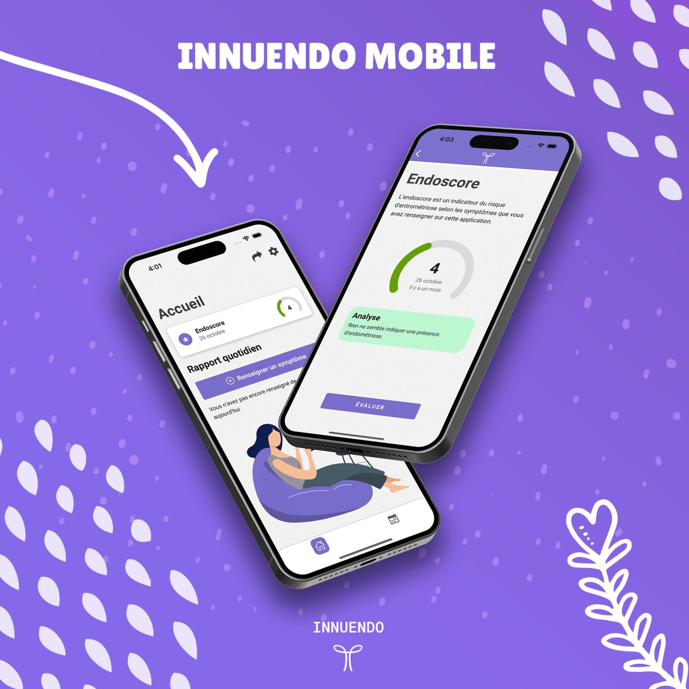
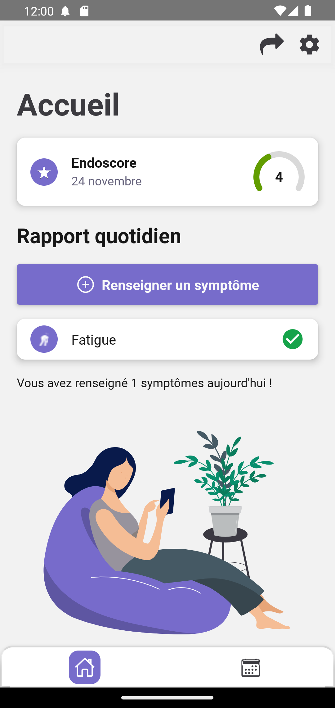
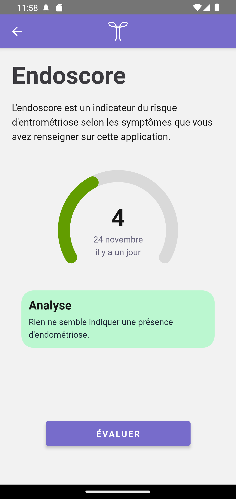
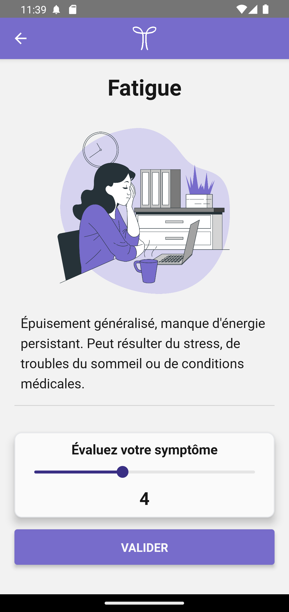

# Application mobile Innuendo



# Sommaire
1. [Introduction](#introduction)
2. [Status du projet](#status-du-projet)
3. [Screenshots](#screenshots)
4. [Lancer le projet en local](#lancer-le-projet-en-local)
5. [Tech Stack](#tech-stack)

# Introduction


[Innuendo](https://www.linkedin.com/company/innuendoeip) est une plateforme de santé de suivi de l'endométriose.
L'endométriose est une maladie courante qui touche de nombreuses femmes, prenant en moyenne 7 à 10 ans pour être diagnostiqué.

Notre objectif est de réduire ce temps de diagnostic en permettant une communication plus facile et plus claire entre les femmes et leurs professionnels de la santé.

Grâce à notre application mobile, les utilisatrices suivent leurs symptômes en remplissant un bilan journalier.
Elles ont accès à un calendrier leur permettant de consulter ou de modifier leurs bilans remplis précèdemment. Elles peuvent ensuite partager leur suivi avec leur médecin traitant avec un code temporaire depuis l'application mobile, lui permettant de consulter l'évolution de leurs symptômes sur une plateforme web.

Ainsi, on obtient une plus grande fiabilité des données pendant l'entretien médical, et des volumes de données pour la recherche contre l'endométriose.

## Status du projet

Innuendo à était réaliser pendant 3 ans dans le cadre du projet d'études [Epitech Innovative Project (EIP)](https://exp.epitech.eu/projet/de19eaed-043d-45cf-95e0-fd8c2f4a2c8c) du campus de la Réunion, ayant reçu le prix "coup de coeur" du jury.

> 🚧 Nous ne travaillons plus sur Innuendo depuis le 2 février 2024. Plutôt que de laisser le projet à l'abandon, nous avons décider de partager ce répertoire pour toute organisation souhaitant reprendre le projet.

Si vous souhaitez reprendre le projet, merci de le reprendre à partir d'un fork.

Vous êtes libre de reprendre le code de ce projet comme bon vous semble, tant que vous laissez une attribution au projet Innuendo, et que vous utilisez une autre marque lors de la redistribution.

Plus d'informations sont disponibles dans la [license](LICENSE.md).

## Screenshots






## Lancer le projet en local

Installer les dépendances

```bash
  npm install
```

Lancer le serveur

```bash
  (android) npm run android
  (ios) npm run ios
```

## Stack technique

- React Native
- Typescript
- [NativeBase](https://nativebase.io/)